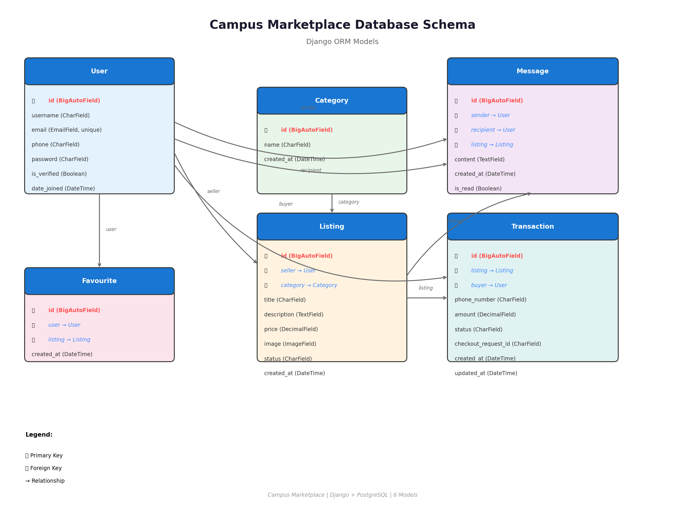

# Campus Marketplace — Backend

Django REST API for a student marketplace with Pesapal payment integration.

## Stack

- Python 3.14, Django 6.0, DRF 3.17
- PostgreSQL (production) / SQLite (development)
- JWT auth via `djangorestframework-simplejwt`
- Pesapal API (sandbox / production)
- Cloudinary (optional — image upload)
- API docs via `drf-spectacular` (OpenAPI 3 + Swagger UI)

## Quick Start

```bash
python -m venv .venv && source .venv/bin/activate
pip install -r requirements.txt
cp .env.example .env   # fill in your Pesapal sandbox creds
python manage.py migrate
python manage.py runserver
```

## API Endpoints

### Auth
| Endpoint | Method | Auth | Description |
|----------|--------|------|-------------|
| `/api/accounts/register/` | POST | No | Create account |
| `/api/accounts/login/` | POST | No | Get JWT tokens |
| `/api/accounts/login/refresh/` | POST | No | Refresh JWT |

### Marketplace
| Endpoint | Method | Auth | Description |
|----------|--------|------|-------------|
| `/api/listings/` | GET/POST | Read-only/Yes | Browse & create listings |
| `/api/listings/<id>/` | GET/PUT/DELETE | Yes | Listing detail, update, delete |
| `/api/listings/<id>/mark_sold/` | PATCH | Yes | Seller marks item as sold |
| `/api/listings/<id>/report/` | POST | Yes | Report a listing |
| `/api/listings/favourites/` | GET | Yes | User's favourited listings |
| `/api/categories/` | GET | No | List categories |
| `/api/favorites/` | GET/POST | Yes | List & add favourites |
| `/api/favorites/<id>/` | DELETE | Yes | Remove favourite |
| `/api/messages/` | GET/POST | Yes | Messages |
| `/api/reports/` | GET/POST | Yes | List & create reports (staff sees all) |

### Payments
| Endpoint | Method | Auth | Description |
|----------|--------|------|-------------|
| `/api/payments/pay/` | POST | Yes | Initiate Pesapal payment |
| `/api/payments/callback/` | POST | No | Pesapal IPN callback |
| `/api/payments/redirect/` | GET | No | Pesapal browser redirect |
| `/api/payments/status/<id>/` | GET | Yes | Check payment status |

### Docs
| `/api/schema/` | GET | No | OpenAPI schema |
| `/api/docs/` | GET | No | Swagger UI docs |

## Database Schema



**6 Models:**
1. **User** — Custom auth with email, phone
2. **Category** — Product categories
3. **Listing** — Items for sale (FK: seller, category)
4. **Favourite** — Saved listings (FK: user, listing)
5. **Message** — Conversations (FK: sender, recipient, listing)
6. **Transaction** — Payments (FK: listing, buyer)

## Environment Variables

| Variable | Required | Description |
|----------|----------|-------------|
| `SECRET_KEY` | Yes | Django secret key |
| `DATABASE_URL` | No | Defaults to SQLite |
| `PESAPAL_CONSUMER_KEY` | Yes | Pesapal API key |
| `PESAPAL_CONSUMER_SECRET` | Yes | Pesapal API secret |
| `PESAPAL_CALLBACK_URL` | Yes | Backend callback URL |
| `PESAPAL_IPN_ID` | Yes | Pesapal IPN registration ID |
| `FRONTEND_URL` | Yes | Frontend URL for redirect |
| `CLOUDINARY_CLOUD_NAME` | No | Cloudinary (image upload) |
| `CLOUDINARY_API_KEY` | No | Cloudinary (image upload) |
| `CLOUDINARY_API_SECRET` | No | Cloudinary (image upload) |

## Testing

```bash
python manage.py test -v 2
```

## CI

GitHub Actions workflow at `.github/workflows/django.yml` runs tests on push/PR to `main` and `dev`.
